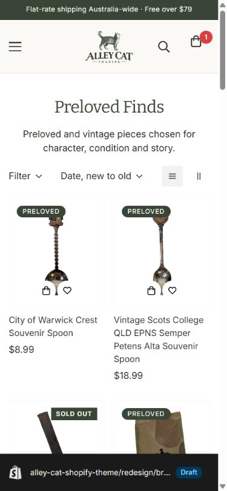
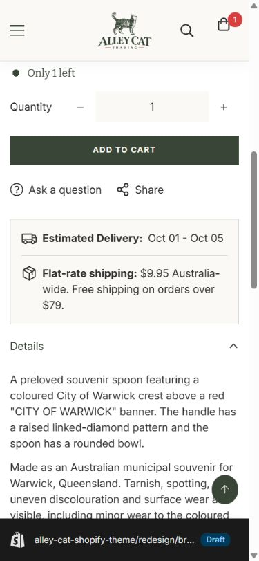
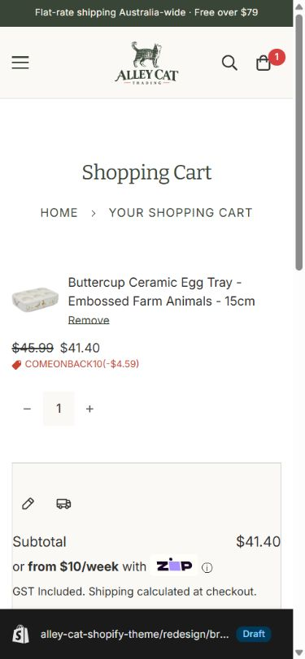

# Alley Cat Trading — draft theme design review

Reviewed 26 September 2026 in Chrome against the unpublished GitHub-connected Minimog draft (`redesign/brand-refresh`, theme `191020368184`). Desktop and a 390 px mobile viewport were checked. The live theme was not published or edited. The draft preview is https://alleycattrading.com.au/?preview_theme_id=191020368184.

## Overall result

The shopping journey now reads as an online trading house: the approved logo, restrained Bitter/Inter typography, cream/eucalyptus palette, and “Thoughtful gifts. Timeless finds.” introduction are consistent. The former shop photograph is absent. “Preloved” is one word in the new theme copy. The top announcement is compact and uses the $79 free-shipping threshold. Key interactions are legible on mobile, including the menu, search, filters, product shipping details, cart drawer, and cart page.

The main remaining work is not a theme styling defect: Shopify-managed policy/payment pages and some catalogue merchandising still reflect the former retail/homewares positioning. These pages are shared with the live store, so this review did not rewrite them through Shopify admin.

## Journey review

| Step | Health | Evidence and finding |
| --- | --- | --- |
| 1. Home and header | Good | The desktop and mobile home have a clear brand proposition, visible navigation/cart, and no closed-store photograph. The mobile menu has an opaque ivory panel. [Desktop](design-audit-2026-09-26/01-home-desktop.png) · [Mobile](design-audit-2026-09-26/02-home-mobile.png) · [Menu](design-audit-2026-09-26/03-mobile-navigation.png) |
| 2. Collection and filters | Good, with merchandising follow-up | “Preloved Finds” has a short introduction and usable cards. Mobile card controls are reduced to cart and wishlist; sold-out cards show one badge rather than an overlapping Preloved label. Filters open on a solid panel with a labelled close button; the very long Product type group starts collapsed. [Mobile collection](design-audit-2026-09-26/04-collection-mobile.png) · [Filters](design-audit-2026-09-26/05-mobile-filter.png) · [Desktop](design-audit-2026-09-26/14-collection-desktop.png) |
| 3. Search | Good | The mobile trigger is a real labelled button, the search overlay is opaque, and generic Minimog suggestions were replaced with Vintage, Collectibles, and Homewares. A Vintage search returned product results and usable filters. [Search overlay](design-audit-2026-09-26/12-search-mobile.png) · [Results](design-audit-2026-09-26/15-search-results-mobile.png) |
| 4. Product | Good | Real product photos and individual condition notes remain. Afterpay and Zip messages render. The low-stock message is factual, the add-to-cart button is square, and the estimated-delivery / $9.95 flat-rate / free-over-$79 card has consistent padding and square corners. [Mobile purchase details](design-audit-2026-09-26/06-product-mobile.png) · [Desktop magazine](design-audit-2026-09-26/10-product-desktop.png) |
| 5. Cart | Good | The cart drawer has an opaque white surface. The mobile cart page now gives the product name its full width, with price, discount, and quantity on separate rows. Existing cart contents were only observed, not changed. [Drawer](design-audit-2026-09-26/07-cart-drawer-mobile.png) · [Cart page](design-audit-2026-09-26/08-cart-page-mobile.png) |
| 6. About | Good | The copy leads with the online, Preloved/vintage promise and does not suggest a currently open retail shop. [About](design-audit-2026-09-26/09-about-mobile.png) |
| 7. Wishlist | Partial | The generic page assignment previously produced a blank body. The draft now renders a useful empty state, but this browser still shows a wishlist counter of 1 while the page shows no product. This needs an app/saved-item check before launch. [Wishlist](design-audit-2026-09-26/13-wishlist-mobile.png) |
| 8. Support and payments | Needs content review | Shipping links to an embedded FAQ; the Shopify shipping-policy page itself merely links onward. The refund policy still discusses in-store purchases and uses “Pre-loved.” Afterpay speaks of “gifts and decor” and retains the old homewares title. Zip is dominated by an oversized promotional image. [Returns](design-audit-2026-09-26/16-returns-mobile.png) · [Afterpay](design-audit-2026-09-26/17-afterpay-mobile.png) · [Zip](design-audit-2026-09-26/11-zip-mobile.png) |

## Priorities before publishing

1. **Merchant content decision — policies and payment pages.** Review the returns policy’s in-store references, change-of-mind exclusions, and “Pre-loved” spelling; update the Afterpay page title/body and consider a concise, accessible Zip explanation. Confirm the shipping FAQ and linked policy clearly state the current $9.95 flat rate and free shipping over $79. These are Shopify-managed, live-shared pages and may need policy/operational review; the draft branch cannot safely update them alone.
2. **Wishlist integration.** Investigate the saved-item counter (1) versus empty wishlist page in the tested browser. The draft now has the correct page structure and empty state, but an inaccessible or stale saved product, or app integration, may be involved.
3. **Merchandising.** Four of the eight new-arrival items visible on the homepage were sold out during review, and a featured Preloved item was sold out. Curate in-stock collection selections or revise collection rules without changing inventory values. Retain an honest Sold Out indication when unavailable items appear.
4. **Catalogue image metadata and quality.** Some product images expose internal `rec…` IDs as alt text, and some gallery originals are only around 510–649 px wide. Theme image markup supplies responsive sizes, so the inconsistent sharpness appears to be at least partly source-image limited. Correct source alt descriptions and replace low-resolution originals where available; do not upscale them artificially.
5. **Operational navigation.** Confirm whether “Pickup Only” still has a valid pickup arrangement now the retail shop is closed. Check whether Careers and the old Home & Style Journal remain useful destinations. No wholesale navigation change was made in v1.

## QA and limits

- Verified visually and through the page accessibility tree on desktop/mobile: logo and header, menu, home, collection, filter opening/closing, search overlay/results, product details, cart drawer/page, About, FAQ entry, shipping-policy link, returns, Afterpay, Zip, and wishlist. The age-gate configuration remains disabled; its inactive markup exists but no blocking overlay appeared. Customer-account entry exists, but a logged-in account was not available for testing.
- Checkout was **not** submitted, and no purchase, cart mutation, customer-account login, or policy/admin content edit was performed. Semantic button labels were verified for the repaired mobile search and filter controls, but keyboard/focus behavior was not exhaustively tested across every app embed. Contrast was reviewed visually, not via a full automated accessibility audit.
- Shopify Theme Check still reports 129 errors in the inherited Minimog codebase. Among files touched in this review, 56 are existing settings-schema validation issues and two are references to an absent SSW widget snippet in the product-card template; no new Liquid parse error was reported. The Shopify Liquid skill validator could not start because its bundled `@shopify/theme-check-common` dependency is missing, so the official Shopify CLI check was used as a fallback. `git diff --check` passed.

## Visual reference

